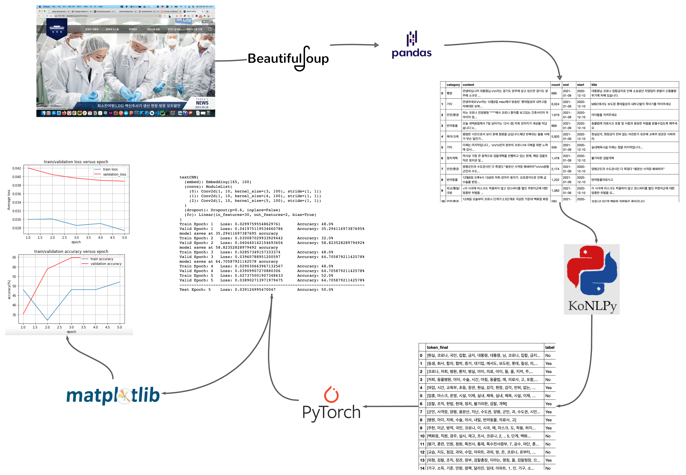

# Deep Learing Side Project

## **국가 청원 글 학습 모델**

> 크롤링으로 데이터 수집을 하고 그 데이터를 전처리 작업을 거치 후에 cleaned data를 기반으로 카테고리 분류를 하고 기존에 학습한 데이터들을 기반으로 새로운 청원글이 올라왔을 때 해당 글이 청원 목표수를 넘길 수 있는지 예측하는 모델

---

---

## 기술 스택

[plowchart](https://lucid.app/lucidchart/35d01c4d-7b6b-4885-9303-c3756b466d82/edit?page=0_0#)

- BeautifulSoup4
  - 데이터 수집 (크롤링)
- Pandas
  - 데이터 분석
- KoNLPy
  - 자연어 처리 (한국어 정보처리)
- Pytorch
  - 딥러닝
- Matplotlib
  - 데이터 시각화

---
